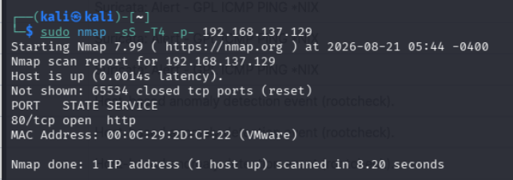
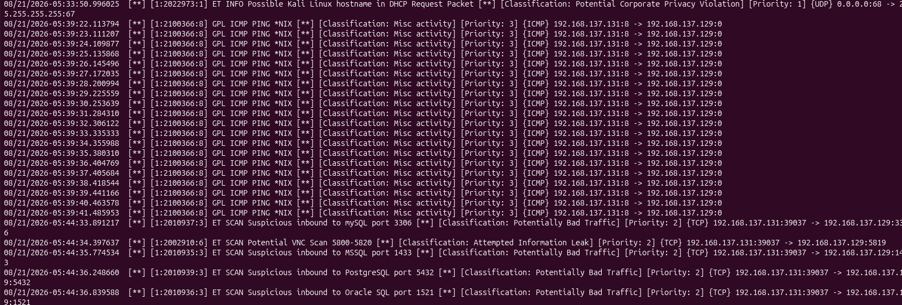
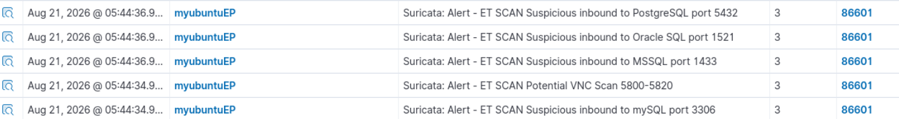
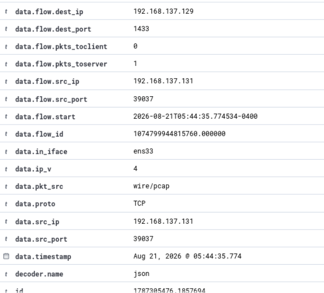

# SOC Threat Detection & Monitoring Lab

## Overview

This project demonstrates a small Security Operations Center (SOC) environment built to detect, analyze, and investigate suspicious network and endpoint activity.

The lab integrates **Wazuh SIEM, Suricata IDS, and VirusTotal threat intelligence**. A Kali Linux system was used to simulate reconnaissance activity against a monitored Ubuntu endpoint.

The environment was tested using:

- ICMP reconnaissance
- Nmap TCP SYN scanning
- Suricata network intrusion detection
- Wazuh SIEM alert monitoring
- File Integrity Monitoring (FIM)
- VirusTotal threat intelligence
- EICAR anti-malware test file

The project demonstrates a detection workflow from generating suspicious activity to detecting, centralizing, and investigating security events within Wazuh.

## Lab Environment

| Component | Purpose |
|---|---|
| Kali Linux | Simulated attacker and reconnaissance system |
| Ubuntu Linux | Monitored endpoint |
| Wazuh Agent | Endpoint monitoring and log collection |
| Wazuh Manager | SIEM analysis and centralized alerting |
| Suricata | Network Intrusion Detection System (IDS) |
| VirusTotal | Threat intelligence and file reputation |
| Nmap | Network reconnaissance simulation |
| EICAR | Safe anti-malware detection test |
## Suricata IDS Configuration

Suricata was configured on the Ubuntu endpoint to monitor network traffic and generate alerts for suspicious activity.

The monitored endpoint was configured as `HOME_NET` using the IP address `192.168.137.129`.


*Figure 1 — Suricata HOME_NET configuration for the monitored Ubuntu endpoint.*

Suricata was configured to load detection rules from `/etc/suricata/rules`.


*Figure 2 — Suricata rule directory configuration.*

Network traffic capture was configured on the `ens33` interface using AF_PACKET.


*Figure 3 — Suricata network capture interface configuration.*

### Wazuh Integration

Wazuh was configured to collect Suricata's JSON-formatted security events from `/var/log/suricata/eve.json`. This allows Suricata network alerts to be forwarded to Wazuh for centralized monitoring and investigation.


*Figure 4 — Wazuh configured to ingest Suricata `eve.json` events.*

### Configuration Validation

Before generating test traffic, the Suricata configuration was validated using:

```bash
sudo suricata -T -c /etc/suricata/suricata.yaml
```

The configuration test completed successfully, confirming that Suricata could load the configuration before network monitoring began.


*Figure 5 — Successful Suricata configuration validation.*

## Reconnaissance Simulation

To generate detectable network activity, the Kali Linux system was used to perform reconnaissance against the monitored Ubuntu endpoint.

A TCP SYN scan was performed using Nmap:

```bash
sudo nmap -sS -T4 -p- 192.168.137.129
```

The scan identified TCP port `80` (HTTP) as open on the Ubuntu endpoint.



*Figure 6 — Nmap TCP SYN reconnaissance scan from Kali Linux against the monitored Ubuntu endpoint.*

## Suricata Detection

Suricata analyzed the reconnaissance traffic and generated multiple alerts associated with network scanning activity.

Detected activity included probes targeting:

- MySQL — TCP/3306
- Microsoft SQL Server (MSSQL) — TCP/1433
- PostgreSQL — TCP/5432
- Oracle SQL — TCP/1521
- VNC — TCP/5800-5820



*Figure 7 — Suricata detecting reconnaissance activity generated by the Nmap scan.*

## Wazuh Alert Monitoring

The Suricata events were forwarded to Wazuh through the `eve.json` integration. Wazuh centralized the IDS alerts and associated them with the monitored Ubuntu endpoint, `myubuntuEP`.

The Threat Hunting dashboard displayed multiple Suricata alerts corresponding to the reconnaissance activity, including probes targeting MySQL, MSSQL, PostgreSQL, Oracle SQL, and VNC services.



*Figure 8 — Suricata reconnaissance alerts displayed in Wazuh Threat Hunting.*

## Alert Investigation

A Suricata alert was expanded in Wazuh to investigate the underlying network flow and determine the source and destination of the suspicious activity.

The event showed:

- **Source IP:** `192.168.137.131` — Kali Linux
- **Destination IP:** `192.168.137.129` — Ubuntu endpoint
- **Protocol:** TCP
- **Destination port:** `1433`
- **Network interface:** `ens33`

The source IP corresponded to the Kali Linux system used to generate the Nmap reconnaissance traffic, while the destination IP corresponded to the monitored Ubuntu endpoint. Destination port `1433` is associated with Microsoft SQL Server (MSSQL).

This investigation correlated the Wazuh security alert with the reconnaissance activity generated from the Kali system and demonstrated how network telemetry can be used to identify the source, target, protocol, and service involved in a security event.



*Figure 9 — Detailed Wazuh event investigation showing the source IP, destination IP, protocol, destination port, and monitored network interface.*
