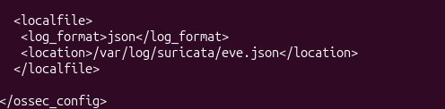
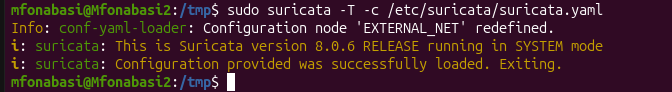

# SOC Threat Detection & Monitoring Lab

## Overview

This project demonstrates a small Security Operations Center (SOC) environment built to detect, analyze, and investigate suspicious network and endpoint activity.

The lab integrates **Wazuh SIEM, Suricata IDS, and VirusTotal threat intelligence**. A Kali Linux system was used to simulate reconnaissance activity against a monitored Ubuntu endpoint.

The environment was tested using:

- ICMP reconnaissance
- Nmap TCP SYN scanning
- Suricata network intrusion detection
- Wazuh SIEM alert monitoring
- File Integrity Monitoring (FIM)
- VirusTotal threat intelligence
- EICAR anti-malware test file

The project demonstrates a detection workflow from generating suspicious activity to detecting, centralizing, and investigating security events within Wazuh.

## Lab Environment

| Component | Purpose |
|---|---|
| Kali Linux | Simulated attacker and reconnaissance system |
| Ubuntu Linux | Monitored endpoint |
| Wazuh Agent | Endpoint monitoring and log collection |
| Wazuh Manager | SIEM analysis and centralized alerting |
| Suricata | Network Intrusion Detection System (IDS) |
| VirusTotal | Threat intelligence and file reputation |
| Nmap | Network reconnaissance simulation |
| EICAR | Safe anti-malware detection test |
## Suricata IDS Configuration

Suricata was configured on the Ubuntu endpoint to monitor network traffic and generate alerts for suspicious activity.

The monitored endpoint was configured as `HOME_NET` using the IP address `192.168.137.129`.


*Figure 1 — Suricata HOME_NET configuration for the monitored Ubuntu endpoint.*

Suricata was configured to load detection rules from `/etc/suricata/rules`.


*Figure 2 — Suricata rule directory configuration.*

Network traffic capture was configured on the `ens33` interface using AF_PACKET.


*Figure 3 — Suricata network capture interface configuration.*

### Wazuh Integration

Wazuh was configured to collect Suricata's JSON-formatted security events from `/var/log/suricata/eve.json`. This allows Suricata network alerts to be forwarded to Wazuh for centralized monitoring and investigation.



*Figure 4 — Wazuh configured to ingest Suricata `eve.json` events.*

### Configuration Validation

Before generating test traffic, the Suricata configuration was validated using:

```bash
sudo suricata -T -c /etc/suricata/suricata.yaml
```

The configuration test completed successfully, confirming that Suricata could load the configuration before network monitoring began.



*Figure 5 — Successful Suricata configuration validation.*
